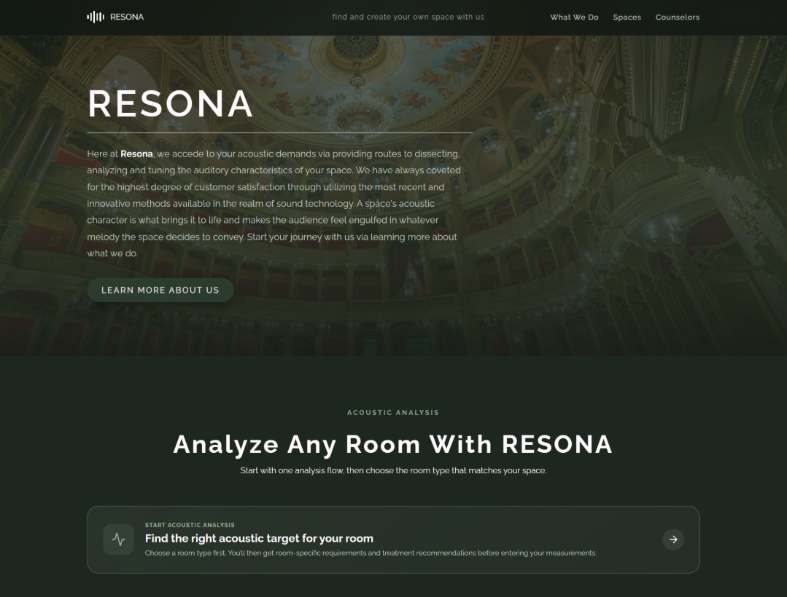
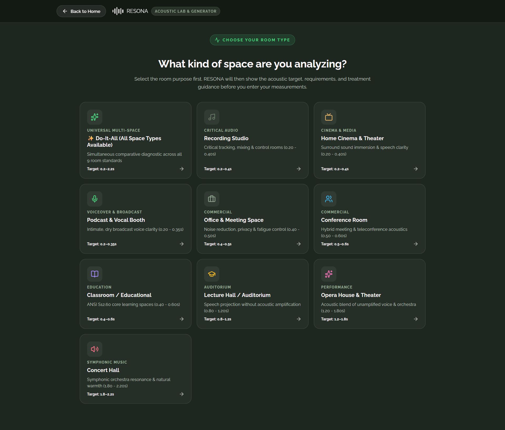
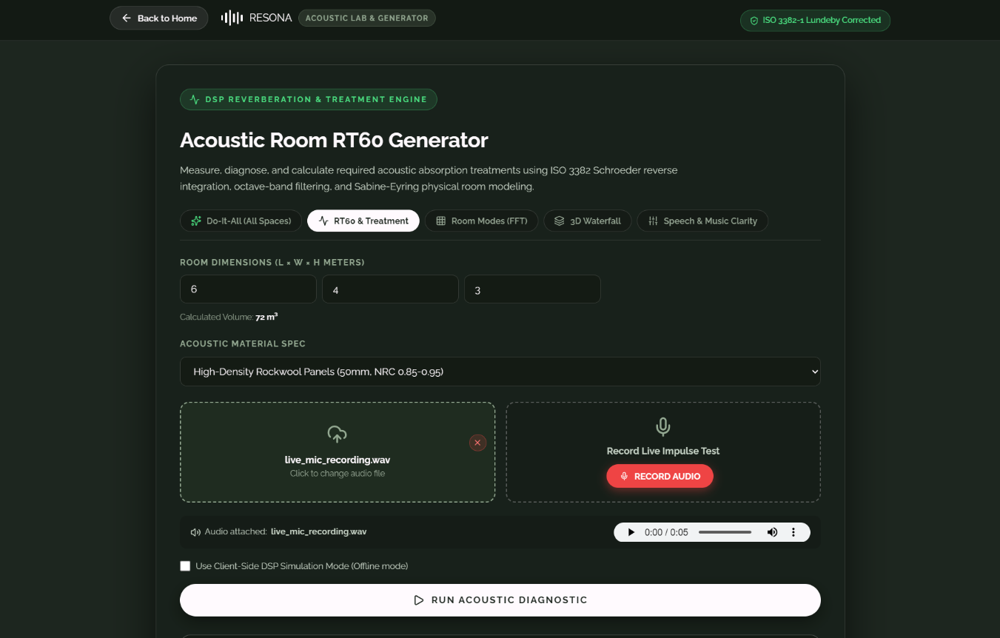
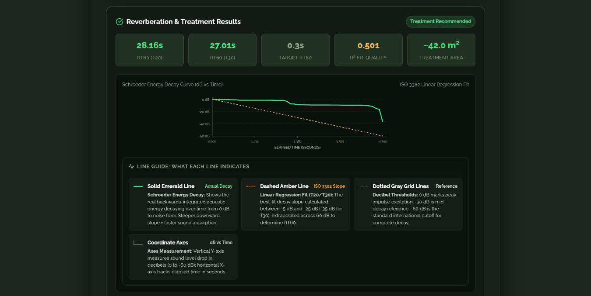
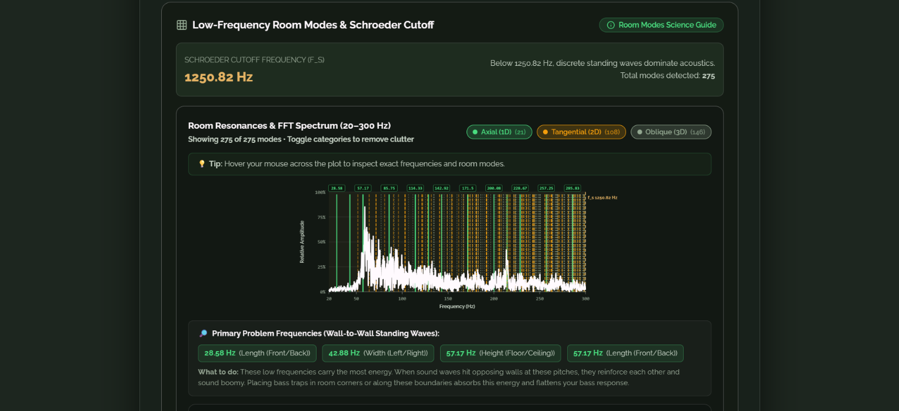
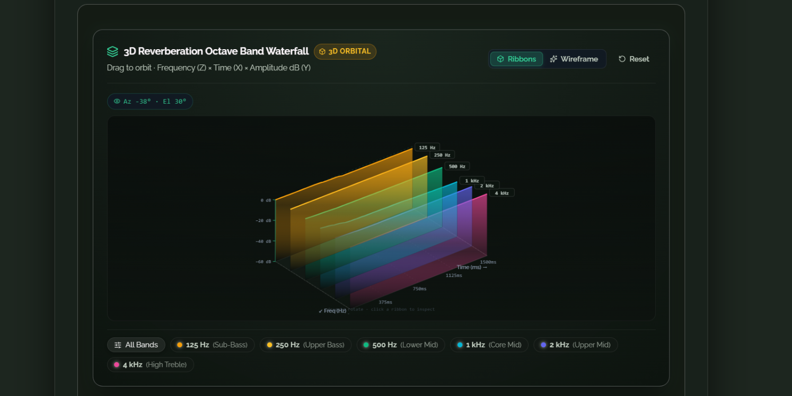
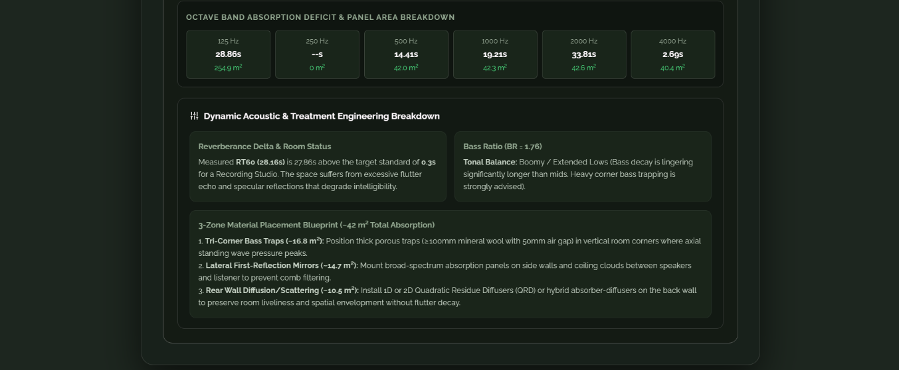
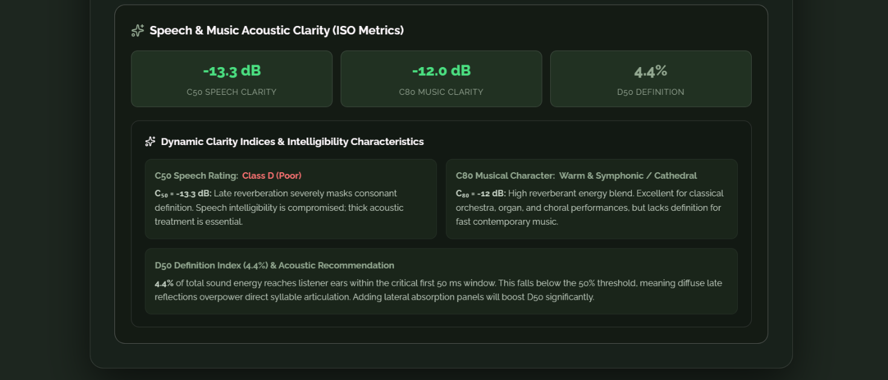

# Resona - Room Acoustics & RT60 Analyzer

[](https://resona-rt60-room-acoustics-analyzer.vercel.app)
[](https://resona-rt60-room-acoustics-analyzer.onrender.com)

Resona is an acoustic engineering web application designed to evaluate room reverberation, identify standing wave resonances, and calculate practical acoustic treatment requirements. It processes recorded impulse responses or room dimensions to generate octave-band RT60 measurements, modal distributions, and 3D spectral decay visualizations.

<!-- Image Placeholder: Application Overview -->



---

## Live Deployment

| Service | URL |
| :--- | :--- |
| Frontend | https://resona-rt60-room-acoustics-analyzer.vercel.app |
| Backend | https://resona-rt60-room-acoustics-analyzer.onrender.com |

---

## Key Capabilities

### 1. RT60 Reverberation Time Measurement
* Calculates standard decay times (T20 and T30 extrapolated to RT60) via backward energy integration (Schroeder method).
* Breaks down reverberation across 6 standard octave bands (125 Hz, 250 Hz, 500 Hz, 1 kHz, 2 kHz, and 4 kHz).
* Evaluates Bass Ratio (BR) and Treble Ratio (TR) to characterize tonal warmth and brightness.

<!-- Image Placeholder: RT60 Octave Analysis & Energy Decay Curve -->



### 2. Room Mode & Resonance Analysis (FFT)
* Computes theoretical standing wave frequencies using the Rayleigh wave equation for rectangular enclosures.
* Distinguishes between Axial (1D, 2-wall), Tangential (2D, 4-wall), and Oblique (3D, 6-surface) room modes.
* Calculates the Schroeder Cutoff Frequency (f_s) to separate discrete modal behavior from diffuse sound fields.
* Overlays measured FFT frequency response directly against calculated mode lines to isolate problematic bass resonances and phase nulls.

<!-- Image Placeholder: Room Mode Spectrum & Modal Distribution -->


### 3. 3D Waterfall Decay Visualization (CSD)
* Renders a 3D Cumulative Spectral Decay (CSD) waterfall plot to inspect how individual frequency bands ring out over time.
* Features interactive 3D orbit controls, customizable wireframe and solid surface rendering, and decay slope analysis.

<!-- Image Placeholder: 3D Waterfall Spectral Decay -->


### 4. Acoustic Treatment Planner
* Implements Sabine and Eyring absorption formulas to compare current room decay against target RT60 values.
* Supports distinct target profiles including control rooms, recording studios, home theaters, classrooms, and conference spaces.
* Generates material breakdowns detailing required square meters of broadband absorption panels, corner bass traps, and diffusers.

<!-- Image Placeholder: Acoustic Treatment Plan -->


### 5. ISO 3382-1 Clarity & Intelligibility Metrics
* **C50 (Speech Clarity):** Early-to-late energy ratio evaluated with a 50 ms cutoff for voice comprehension.
* **C80 (Music Clarity):** Early-to-late energy ratio evaluated with an 80 ms cutoff for musical articulation.
* **D50 (Definition):** Direct-to-total sound energy percentage.

<!-- Image Placeholder: Clarity & Intelligibility Metrics -->


---

## Tech Stack

### Frontend
* React 19
* Vite 8
* Lucide React
* Vanilla CSS (modular design system)

### Backend
* Python 3.11 / Flask 3.1
* Librosa (audio loading, resample handling, STFT)
* NumPy & SciPy (digital signal processing, filter banks, peak detection)
* Gunicorn (production WSGI server)

---

## Project Structure

```
Resona/
├── Backend/
│   ├── app.py              # Flask REST API endpoints
│   ├── dsp.py              # Schroeder decay, RT60 estimation, FFT, and modal math
│   ├── audio_utils.py      # Audio decoding and impulse response validation
│   ├── treatment.py        # Sabine/Eyring acoustic treatment engine
│   └── requirements.txt    # Python backend dependencies
├── frontend/
│   ├── src/
│   │   ├── components/     # UI modules (WaterfallPlot3D, AnalyzerModal, etc.)
│   │   ├── pages/          # GeneratorPage, LandingPage
│   │   └── styles/         # CSS design tokens and component stylesheets
│   ├── public/             # Static assets and documentation images
│   ├── package.json
│   └── vite.config.js
└── docs/
    └── images/             # Documentation screenshot assets
```

---

## Local Development Setup

### Prerequisites
* Python 3.10+
* Node.js 18+ and npm

### 1. Backend Setup

```bash
cd Backend
python -m venv venv

# Windows:
venv\Scripts\activate

# macOS/Linux:
# source venv/bin/activate

pip install -r requirements.txt
python app.py
```

The Flask server will start at `http://localhost:5000`.

### 2. Frontend Setup

In a new terminal:

```bash
cd frontend
npm install

# Point the frontend to the local API:
echo VITE_API_URL=http://localhost:5000 > .env

npm run dev
```

The client will start at `http://localhost:5173`.

---

## API Endpoints

| Method | Endpoint | Description |
| :--- | :--- | :--- |
| `POST` | `/energydecay` | Accepts an audio file, returns energy decay curve (EDC) data. |
| `POST` | `/RT60` | Computes octave-band RT60 decay values, Bass Ratio, and Treble Ratio. |
| `POST` | `/fft` | Generates frequency magnitude spectrum data. |
| `POST` | `/clarity` | Computes ISO 3382 C50, C80, and D50 clarity metrics. |
| `POST` | `/roommodes` | Computes room modes (Axial, Tangential, Oblique), Schroeder frequency, and overlays FFT peaks. |
| `POST` | `/waterfall` | Computes time-frequency decay slices for 3D waterfall plots. |
| `POST` | `/treatment` | Computes required absorption area and panel recommendations. |

---

## Environment Variables

| Variable | Description | Default / Production Value |
| :--- | :--- | :--- |
| `VITE_API_URL` | Base URL of the backend Flask API | `https://resona-rt60-room-acoustics-analyzer.onrender.com` |

When deploying to Vercel, define `VITE_API_URL` under **Project Settings > Environment Variables**.

---

## Philosophy
A room is never just an empty container for sound - it is the final, unskippable component in the audio chain. Even the most accurate loudspeakers and instruments cannot overcome severe standing wave buildup or unbalanced decay times. Resona was built to make architectural acoustics accessible, translating complex wave mechanics into practical, actionable spatial design.

Accurate acoustics are not accidental. They are engineered.

---

## Authors

Sanjana Hassan, Azrin Karim & Tarana Ahmed

---

## License

This project is licensed under the [MIT License](LICENSE).